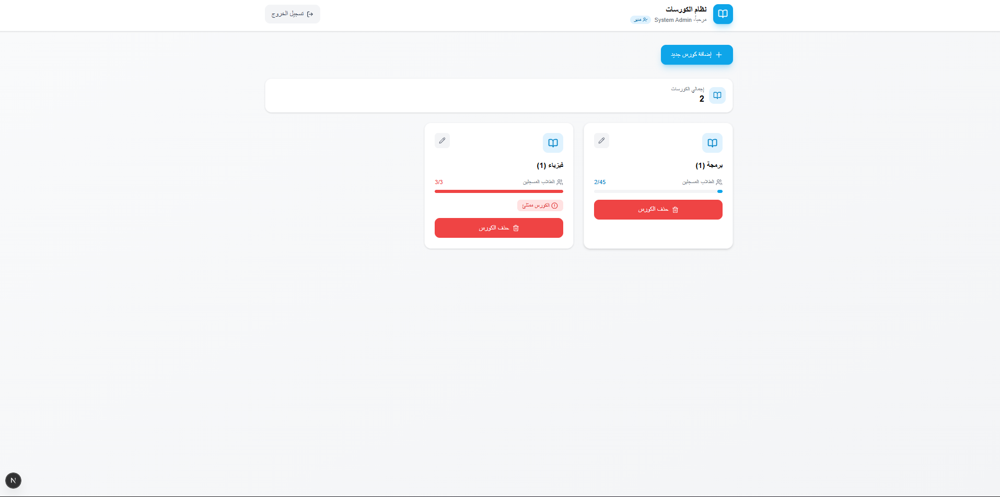
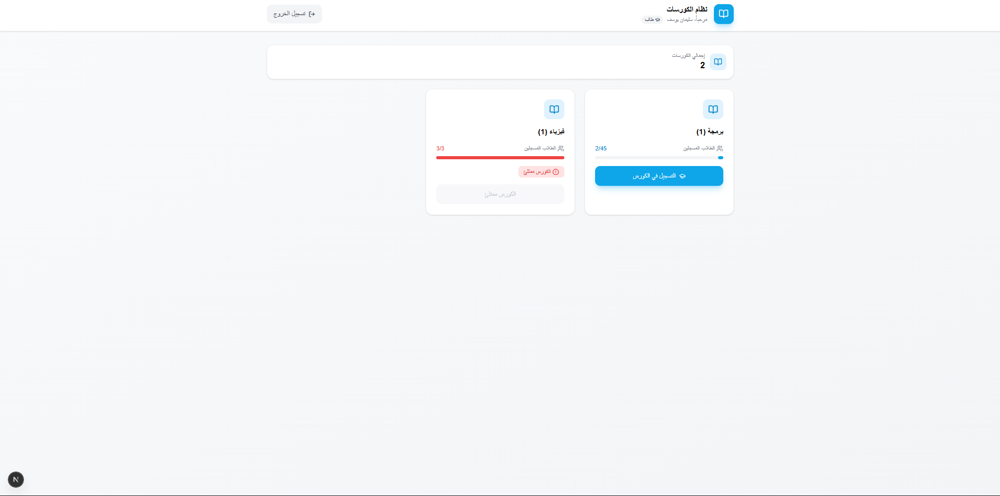

# Course Enrollment System - Frontend

نظام تسجيل الكورسات - الفرونت اند (React/Next.js)

---

## فكرة المشروع

نظام بسيط لإدارة الكورسات يتيح للمدير إضافة وتعديل وحذف الكورسات، بينما يمكن للطلاب عرض الكورسات والتسجيل فيها.

---

## صور المشروع

### لوحة المدير (Admin)



### لوحة الطالب (Student)



---

## التقنيات المستخدمة

- **Next.js 15** - React Framework
- **TypeScript** - Type Safety
- **Tailwind CSS v4** - Styling
- **Axios** - HTTP Client
- **React Hot Toast** - Notifications
- **Lucide React** - Icons

---

## 2) Frontend (React)

### A) Login Page

- Email + Password
- Save token in localStorage after login

### B) Courses Page

**Display list of courses with:**

- title
- capacity
- enrolled_count

**Actions:**

- **Student:** Enroll button
- **Admin:** Add Course (modal) + Edit + Delete

Simple UI with Tailwind CSS.

---

## التشغيل

**Step 1:** تثبيت الـ dependencies

```bash
npm install
```

**Step 2:** تشغيل سيرفر التطوير

```bash
npm run dev
```

التطبيق سيعمل على: `http://localhost:3000`
